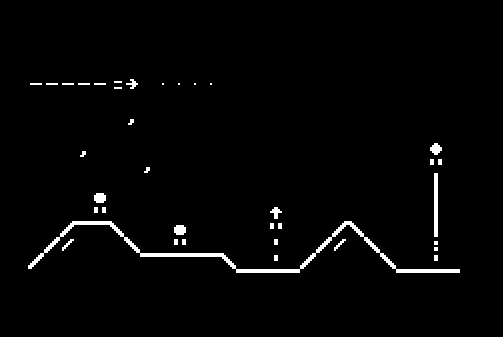
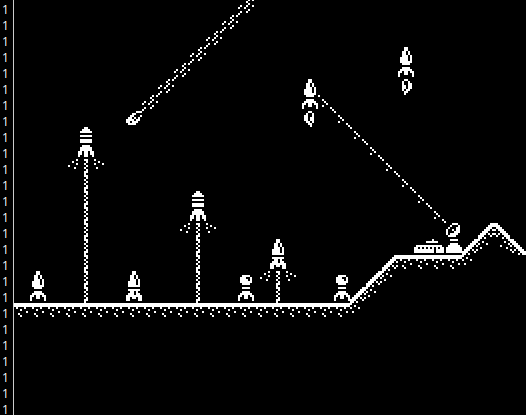
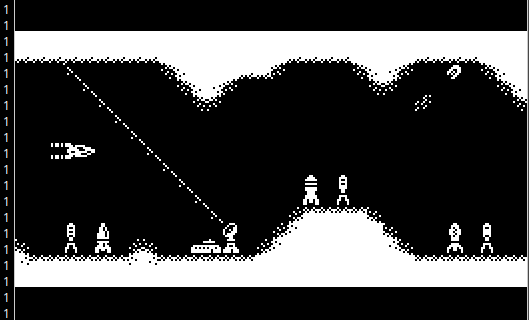
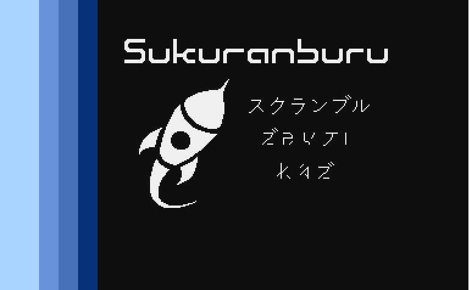

# 2. Projekt

Zaprototypujmy grę przy użyciu Atari FontMaker:

Jak możemy zauważyć, wyłania się znany motyw: *lecimy w prawo i żadna rakieta nie może się nam oprzeć* co brzmi jak credo prawicowych podrywaczy ;D

Teraz możemy popracować nad zestawem znaków. Tutaj nie będę udawał, że potrafię rysować: główny zestaw znaków wykonał Kaz, modyfikacji dokonał MADRAFi, dopiero na końcu się tego dotknąłem i zmieniłem detale wedle własnego uznania.

Wygląda już bajerancko, jednakże jesteśmy wciąż na etapie koncepcji dlatego folgujmy swojej fantazji dalej :]

Tak, wygląda, że to jest to! Gra to będzie scroll w prawo z generacją tunelu i omijaniem przeszkód, może nawet będziemy je zestrzeliwać? Zobaczymy jak dobrze pójdzie nam kodowanie...

Kaz wykonał także planszę tytułową do gry, więc wykorzystajmy ją by mieć natchnienie do dalszej pracy:

Nie będę opisywał gameplayu bo wynika on z obrazków, ile z tego wykonamy to zależeć będzie tylko od naszej determinacji, może cześć zostawię Ci do wykonania samodzielnie? Zobaczymy :]
