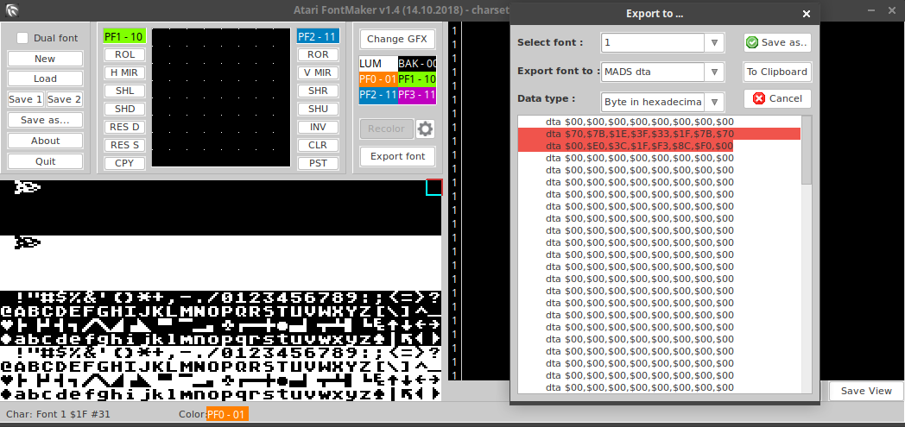
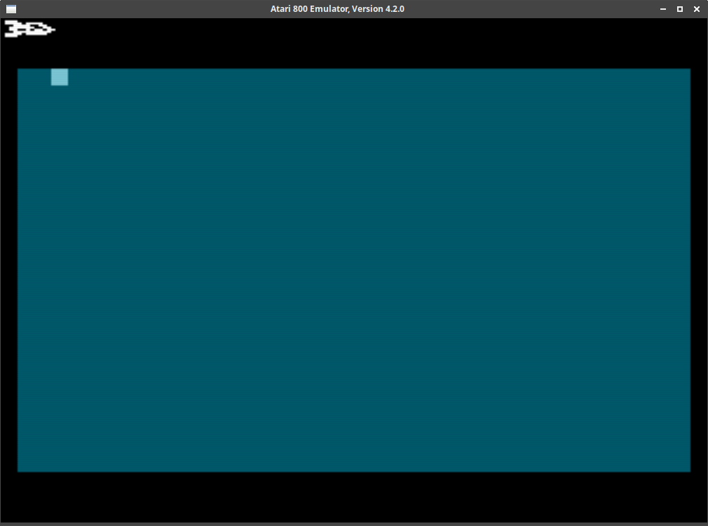

# 11. Player Graphics

Mam nadzieję, że przeczytałeś z uwagą materiały z części 10 ninejszczego tutoriala ;) pełen tej nadzieji będę zapełniał rejetry danymi bez wdawania się w szczegóły, które powinny być Ci już w miarę znajome ;)

## Projekt graficzny

Aby wykonać grafikę naszego pojazdu możesz posłużyć się dowolnym narzędziem, nawet papierem milimetrowym i ołówkiem oraz wyliczyć wartości poszczególnych bajtów ręcznie ;)

Godnym polecenia jest [Sprite Editor XL](http://bocianu.atari.pl/blog/spriteXL) z którego można skorzystać w przeglądarce internetowej.

Ja poszedłem na skróty i narysowałem pojazd w hi-res w narzędziu w którym będziemy rysowali nasz zestaw znaków, oczywiście musiałem pamiętać, że stateczek jaki wyrysowałem na 2 znakach po przeniesieniu tych samych danych na pamięć duszka będzie szerokości `4` znaków ekranowych bo każdy piksel z pół cyklu koloru będzie rysowany w jednym cyklu, mówiąc po ludzku: grafika będzie 2x rozciągnięta horyzontalnie w stosunku do tego co narysujemy w programie FontMaker. Założenie mamy też takie, że duszki będę *jednowierszowe* co to znaczy powinieneś już wiedzieć z lektury wzmiankowanych materiałów.

Po narysowaniu wyeksportowałem dane o tak:



## Jak użyć tych liczb?

Jest wiele sposóbów by w Mad Pascalu skorzystać z danych, które przed chwilą wyeksportowaliśmy. Możemy np. wrzucić je do jakiejś statycznej tablicy, użyć jako `dat` w bloku **ASM** itd. Ja wybrałem sposób chyba najbardziej elegancki, dołączam te dane jako zasób binarny.

Aby to zrobić to w dowolnym edytorze obsługującym pliki binarne (ja skorzystałem z Sublime Text ustawiając kodowanie na **Hexadecimal**) wklejami nasze dane i zapisujemy je jako np. `gfx_ship_bin`.

Aby uniknąć podczas poruszania się góra / dół (za pomocą kopiowania danych) pozostawiania starych danych dodałem łącznie cztery `0` do wyeksportowanych danych po jednym na początku każdego znaku i po jednym na jego końcu, w ten sposób z `8` bajtów na jednego duszka (pół rakiety) zrobiło mi się ich `10` :] Gdy poruszać się będiemy więcej niż o jedną linię rastra to będzie trzeba dodać tych `0` odpowiednio więcej, na ten moment zapewniliśmy sobie czyszczenie przy ruchu góra/dół o jedną linię.

Nasz dane powinny wyglądać tak:

```
0070 7b1e 3f32 1f7b 7000 0000 c060 30d8
f0e0 0000
```

Teraz stwórzmy plik z zasobami `gfx.rc` w katalogi `res` a w nim napiszmy co następuje:

```
GFX_SHIP_ADR rcdata 'res/gfx_ship.bin'
```

Ja zapewne pamiętasz z części poświęconej **Display List** stała `GFX_SHIP_ADR` wskazuje miejsce w pamięci gdzie życzylibyśmy sobie by znalazły się nasze dane. Skoro tak to ją zadeklarujmy w pliku `const.inc` w katalogu głównym:

```
GFX_SHIP_ADR = $1000;
```

Ok. Grafika powinna siedzieć już w pamięci.

## Wywołujemy duchy :]

W pliku `main.pas` (później powynosimy kod do odpowiednich bibliotek) dołączmy nasze zasoby jako stałe:

```pascal
{$i const.inc}
{$r res/gfx.rc}
```

Teraz napiszmy procedurę inicjującam naszą aplikację / grę:

```pascal
procedure init;
begin
  systemOff; DMACTL := 0;

  // tutaj będzie nasz kod

  pause; DMACTL := %00111110;
end;
```

Procedura przygotowuje nasz komputer do pracy: wyłącza system, wyłącza **ANTIC** a na końcu czeka na **VBLK** i podczas gdy działo elektronowe wraca do lewego górnego rogu ekranu mu odpalami **ANTIC** w włączonymi *jednowierszowymi sprajtami* i polem gry o *normalnej* szerokości.

Znaczenie bitów dla **DMACTL** możesz przypomnie sobie np. [tutaj](http://atariki.krap.pl/index.php/Rejestry_ANTIC-a).

#### Będziemy potrzebowali jeszcze paru stałych

W pliku `const.inc` dodajemy:

```pascal
PM_ADR              = $1000;          // players & missiles memory (2K) start address
M0_ADR              = PM_ADR + $300;  // missile 0 start memory address
P0_ADR              = PM_ADR + $400;  // player 0 start memory address
P1_ADR              = PM_ADR + $500;  // player 1 start memory address
GFX_SHIP_ADR        = $1000;          // ship gfx memory start address, ship size = 20 bytes, 16 bytes for gfx and 4 bytes fo top/bottom empty rows
GFX_SHIP_SEG        = 10;             // ship gfx 10 byte segment, 10B for P0 & 10B for P1

```

Wyjaśnienia wymgają może dwie rzeczy:

* Adres `PM_ADR` wykorzystywany przez `PMBASE` jest identyczny z `GFX_SHIP_ADR` z takiego to powodu, że pierwsze $300 bajtów pamięci którą rezerwuję na duszki jest niewykorzystywane, więc szkoda zmarnować taką ilość pamięci. Pamięc efektywnie wykorzystywana przez duszki zaczyna się od początku pamięci pierwszego **missile** czyli `M0_ADR`.
*  `P0_ADR` i `P1_ADR` dodają odpowednio do `PM_ADR` `$400` i `$500` ponieważ - jak może pamiętasz - pamięć dla **players** zaczyna się od `PMBASE  + $400` i ma offset `$100`.

Także w tej chwili mamy ustalone adresy dla nszych graczy i sprajtów w ogóle.

#### Teraz potrzebujemy paru rejestrów

W pliku `lib/registers.pas` dodajemy:

```pascal
var
  RTCLOK  : byte absolute $14;
  HPOSP0  : byte absolute $D000;  // (W) Horizontal position of player 0
  HPOSP1  : byte absolute $D001;  // (W) Horizontal position of player 1
  SIZEP0  : byte absolute $D008;  // (W) Size of player 0
  SIZEP1  : byte absolute $D009;  // (W) Size of player 1
  COLPM0  : byte absolute $D012;  // (W) Color and luminance of player and missile 0
  COLPM1  : byte absolute $D013;  // (W) Color and luminance of player and missile 1
  PRIOR   : byte absolute $D01B;  // (W) Priority selection register
  GRACTL  : byte absolute $D01D;  // (W) Used with DMACTL to latch all stick and paddle triggers
  PORTB   : byte absolute $D301;  // (W/R) Port B. Reads or writes data to and/or from jacks three and four
  DMACTL  : byte absolute $D400;  // (W) Direct Memory Access (DMA) control
  DLIST   : word absolute $D402;  // Display list pointer
  PMBASE  : byte absolute $D407;  // (W) MSB of the player/missile base address used to locate the graphics for your players and missiles
  NMIEN   : byte absolute $D40E;  // (W) Non-maskable interrupt (NMI) enable
  NMIVEC  : word absolute $FFFA;  // The NMI interrupts are vectored through 65530 ($FFFA) to the NMI service routine

  HPOSP01 : word absolute $D000;
  SIZEP01 : word absolute $D008;
  COLPM01 : word absolute $D012;
  ```

  Jak łatwo zauważyć stworzyłem sobie zmienne pomocnicze `HPOSP01`, `SIZEP01` i `COLPM01`. Skoro nasz pojazd składa się z dwóch duszków P0 i P1 to będę do tych rejestrów wpisywał dane *po sobie*, ułatwi nam to troch zapis.

#### Odrobina zmiennych własnych

W `main.pas` deklarujemy:

```pascal
var
  hposp0    : byte absolute 0;
  hposp1    : byte absolute 1;
  wShipHpos : word absolute 0;
```

Jak widać przygotowaliśmy zmienne na stronie zerowej do przechowywania pozycji `X` naszego pojazdu których wartość będziemy przepisywać do odpowiednich rejestrów.

`wShipHpos` to stara sztuczka, która pozwali nam za jednym zamachaem wrzucić `hposp0` i `hposp1` do naszego *podwójnego* rejestru `HPOSP01` :]

#### Napełniamy procedurę `init` treścią

```pascal
procedure init;
begin
  systemOff; DMACTL := 0;

  PMBASE := hi(PM_ADR);
  hposp0 := 44; hposp1 := 52; HPOSP01 := wShipHpos;
  COLPM01 := $0f0f; SIZEP01 := 0; PRIOR := 0; GRACTL := %00000011;

  FillByte(pointer(M0_ADR), $500, 0);
  Move(pointer(GFX_SHIP_ADR), pointer(P0_ADR + 8), GFX_SHIP_SEG);
  Move(pointer(GFX_SHIP_ADR + GFX_SHIP_SEG), pointer(P1_ADR + 8), GFX_SHIP_SEG);

  pause; DMACTL := %00111110;
end;

```

No to idziemy przez kod step-by-step:

* `PMBASE := hi(PM_ADR;` wpisujemy do rejestru starszy bajt adresu pamięci jaką przeznaczyliśmy na duszki
* `hposp0 := 44; hposp1 := 52; HPOSP01 := wShipHpos;` ustalamy pozycję na osi `X` dla naszych *graczy*. By P0 i P1 były obok siebie ich pozycja musi się różnić o ich szerokość czyli `8`.
* `COLPM01 := $0f0f;` nasz kolejny *podwójny* rejestr, ustawiamy biały kolor `$0f` dla obu sprajtów.
* `SIZEP01 := 0;` zapewnia nam normalną szerokoć dla obu **playerów**
* `PRIOR := 0;` wybieramy kolejność/priorytet wyświetalnia grafiki ma ekranie
* `GRACTL := %00000011;` bit 0 ustawiony na `1` włącza pociski, bit 1 ustaiony na `1` włącza graczy
* `FillByte(pointer(M0_ADR), $500, 0);` nie wiemy w jakim stanie jest pamięć naszego komputera dlatego czyścimy ją sobie od `M0_ADR` przez kolejnych `5` stron pamięci wypełniając zerami. Pamięć na duszki (w naszym przypadku) to `2KB` czyli `8` stron z czego `3` pierwsze są nie wykorzystane i wrzucilśmu już tam grafikę naszego pojazdu dlatego czyścimy tylko `5` pozostałych.
* `Move(pointer(GFX_SHIP_ADR), pointer(P0_ADR + 8), GFX_SHIP_SEG);` kopiujemy z naszej matrycy statku jego pierwszy segment i wrzucamy od początku pamięci przeznaczonej dla **P0** + `8` ponieważ pierwsze 8 lini skaningowych nie jest *rysowanych*
* `Move(pointer(GFX_SHIP_ADR + GFX_SHIP_SEG), pointer(P1_ADR + 8), GFX_SHIP_SEG);` kopiujemy *dziób* naszej rakiety do gracza 1 czyli **P1** i również dodajemy `8`

## Upragnione efekty

W pliku `man.pas` wywołujemy procedurę `init`

```pascal
begin
  init;
  repeat until false;
end.
```

Naszym oczom ukazuje się poniższy widok (jeżeli używamy systemu PAL, dla NTSC trzeba dodać więcej niż 8 do współrzędnej `Y`):



Przydało by się jeszcze by nasz pojazd się poruszał. Wykorzystajmy do tego przygotowaną wcześniej procedurę do obsługi **VBI** aby zapewnić sobie miarowy ruch, wpiszmy:

```pascal
procedure vbi; interrupt;
begin
  asm { phr };

  Inc(hposp0); Inc(hposp1); HPOSP01 := wShipHpos;

  asm { plr };
end;
```

Zaresjetrujmy naszą procedurę za pomocą `setVbi(@vbi);`, skompilujmy nasz program i podziwiajmy naszego pierwszego animowanego duszka :]


## Nasz kod

Na koniec dnia nasz plik `main.pas` powinine wyglądać w ten sposób:

```pascal
{$librarypath 'lib'}

program Game;

uses registers, gr, sys;

const
{$i const.inc}
{$r res/gfx.rc}

var
  hposp0    : byte absolute 0;
  hposp1    : byte absolute 1;
  wShipHpos : word absolute 0;


procedure vbi; interrupt;
begin
  asm { phr };

  Inc(hposp0); Inc(hposp1); HPOSP01 := wShipHpos;

  asm { plr };
end;

procedure init;
begin
  systemOff; DMACTL := 0;

  PMBASE := hi(PM_ADR);
  hposp0 := 44; hposp1 := 52; HPOSP01 := wShipHpos;
  COLPM01 := $0f0f; SIZEP01 := 0; PRIOR := 0; GRACTL := %00000011;

  FillByte(pointer(M0_ADR), $500, 0);
  Move(pointer(GFX_SHIP_ADR), pointer(P0_ADR + 8), GFX_SHIP_SEG);
  Move(pointer(GFX_SHIP_ADR + GFX_SHIP_SEG), pointer(P1_ADR + 8), GFX_SHIP_SEG);

  pause; DMACTL := %00111110; setVbi(@vbi);
end;

begin
  init;
  repeat until false;
end.
```

## Dodatek - Parametry ekranu

>**$D000 HPOSP0**
>
>(W) Horizontal position of player 0. Values from zero to 227 ($E3) are possible but, depending on the size of the playfield, the range can be from 48 as the leftmost position to 208 as the rightmost position. Other positions will be "off screen". Here are the normal screen boundaries for players and missiles. The values may vary somewhat due to the nature of your TV screen. Players and missiles may be located outside these boundaries, but will not be visible (off screen):

```
                               Top
                           32 for single,
                        16 for double line
                            resolution
                  +--------------------------------+
                  |                                |
                  |                                |
                  |                                |
     48 for both  |                                | 208 for both
     resolutions  |                                | resolutions
                  |                                |
                  |                                |
                  |                                |
                  +--------------------------------+
                              Bottom
                          224 for single,
                        112 for double line
                             resolution
```